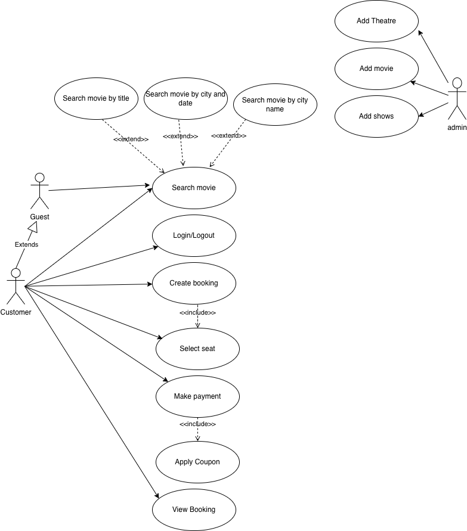
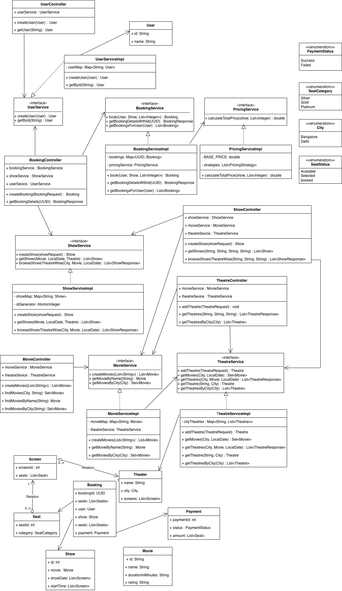
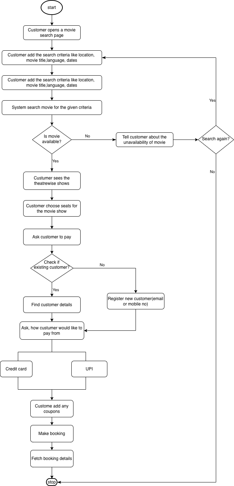
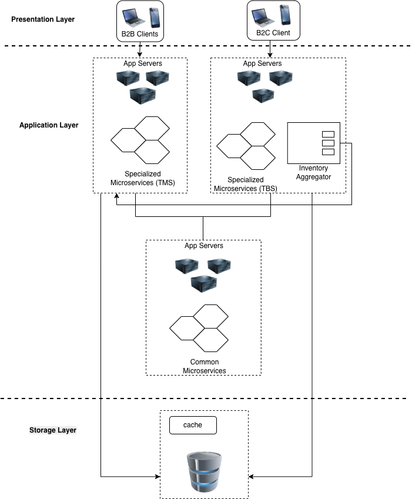

# Movie Ticket Booking System

## Overview
An online movie ticket booking system facilitates the purchasing of movie tickets to its customers. E-ticketing systems allow customers to browse through movies currently playing and book seats, anywhere and anytime.

## Tech Stack
- Java
- Spring Boot
- In Memory data saving (Used Map)

## How to Run
1. Clone repo
2. Run `mvn spring-boot:run`

## Features
- Book tickets
- Seat locking
- Payment simulation

## Design Used
- Strategy Pattern for pricing
- Service layer architecture

## System Requirements

### Functional
1. Enable theatre partners to onboard their theatres over this platform and get access to a bigger customer base while going digital.
2. Enable end customers to browse the platform to get access to movies across different cities, languages, and genres, as well as book tickets in advance with a seamless experience.
3. Browse theatres currently running the show (movie selected) in the town, including show timing by a chosen date.
4. Booking platform offers in selected cities and theatres:
     50% discount on the third ticket
   Tickets booked for the afternoon show get a 20% discount
5. Book movie tickets by selecting a theatre, timing, and preferred seats for the day.
6. Theatres can create, update, and delete shows for the day.
7. Theatres can allocate seat inventory and update them for the show.
8. Bulk booking and cancellation.

### Non-Functionl
1. Describe transactional scenarios and design decisions to address the same.
2. How to scale to multiple cities, countries and guarantee platform availability of 99.99%?
3. Integration with payment gateways
4. How do you monetize platform?
5. How to protect against OWASP top 10 threats.
6. Integrate with theatres having existing IT system and new theatres and localization(movies).
7. Any Compliance

## Use Case Diagram

We have three main Actors in our system:

* **Admin** : Responsible for adding new movies and their shows, canceling any movie or show, blocking/unblocking customers, etc.
* **Customer** : Can view movie schedules, book, and cancel tickets.
* **Guest** : All guests can search movies but to book seats they have to become a registered member.

Here are the top use cases of the Movie Ticket Booking System:

* **Search movies**: To search movies by title, genre, language, release date, and city name.
* **Create/Modify/View booking**: To book a movie show ticket, cancel it or view details about the show.
* **Make payment for booking**: To pay for the booking.
* **Add a coupon to the payment**: To add a discount coupon to the payment.
* **Assign Seat**: Customers will be shown a seat map to let them select seats for their booking.

Here is the use case diagram of Movie Ticket Booking System:

## Class Diagram
Here are the main classes of the Movie Ticket Booking System:

Class Diagram for Movie Ticket Booking System:

## Activity Diagrams
**Make a booking**: Any customer can perform this activity. Here are the steps to book a ticket for a show:

## High Level Architecture
We will be using a 3-tier design model with distinct layers, each having a unique set of responsibilities — presentation, application and persistence.
Presentation layer can be developed using any modern frameworks/libraries like ReactJS, Angular etc. Application layer implements a microservices-oriented architecture. 
Each microservice implements a hexagonal design pattern for better adaptability, extensibility and easier maintenability.

